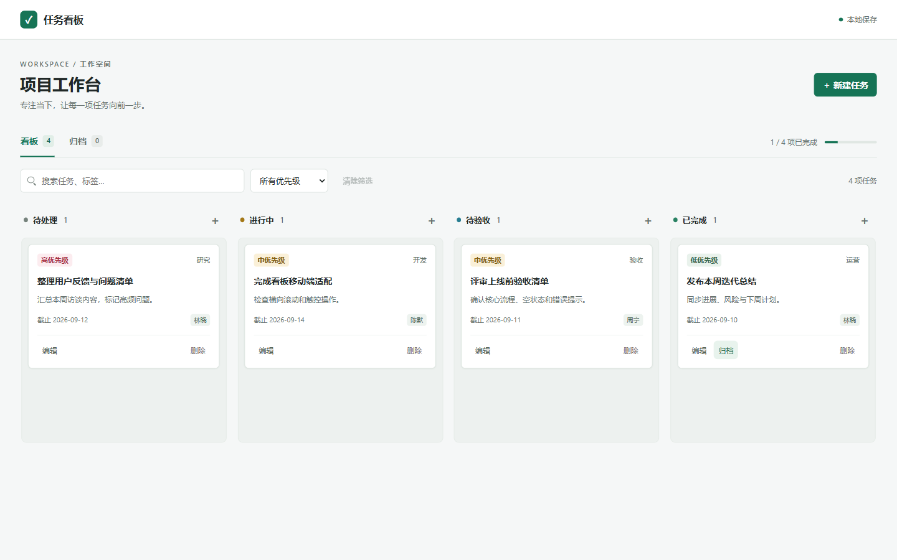

# Taskleaf

轻量的本地任务看板。使用 HTML、CSS 和原生 JavaScript 构建，通过 Vite 开发与打包，无运行时框架依赖。

## 界面预览



截图使用演示数据，不包含个人任务。

## 功能

- 待处理、进行中、待验收、已完成四列看板
- 新建、编辑、删除任务，以及标题必填校验和删除确认
- 优先级、标签、描述与截止日期
- 跨列拖拽与列内排序
- 搜索与优先级筛选
- 已完成任务归档、按归档日期倒序分组、恢复任务
- localStorage 本地持久化
- 响应式布局、键盘焦点反馈和减少动态效果设置

## 运行

需要 Node.js 20.19+（20.x）或 22.12+，以及 npm。建议使用 Node.js 24。

在仓库目录安装依赖并启动开发服务器：

```sh
npm install
npm run dev
```

访问 `http://127.0.0.1:4173/task-board.html`，或打开根地址自动进入看板。

### 构建与预览

```sh
npm run build
npm run preview
```

构建产物位于 `dist/`，预览地址为 `http://127.0.0.1:4174/task-board.html`。部署时将整个 `dist/` 目录上传至静态托管服务；根入口和 `task-board.html` 均保留。

开发端口固定为 4173，端口占用时会明确报错，不会自动切换导致本地数据看似丢失。可以使用 `npm run dev -- --port 5173` 手动换端口，但新端口不会共享原来的任务数据。

## 数据说明

- 数据仅存储在当前浏览器的 localStorage 中，键名为 `task-board-v1`。
- 未配置服务器、数据库、账户系统或跨设备同步。
- 不同浏览器、地址、协议或端口不会自动共享任务数据；直接打开文件时的存储行为取决于浏览器。
- 清理浏览器站点数据可能丢失任务，重要信息请自行备份。
- 首次打开包含演示任务；归档按浏览器本地日期记录。

## 文件

- `task-board.html`：页面结构、样式与交互逻辑；Vite 构建时处理内联模块脚本。
- `index.html`：根地址入口，跳转至看板。
- `vite.config.js`：开发、预览端口与多页面构建配置。
- `docs/images/taskleaf-board.png`：README 界面截图。
- `package-lock.json`：锁定依赖版本；已有锁文件时可使用 `npm ci` 安装。
